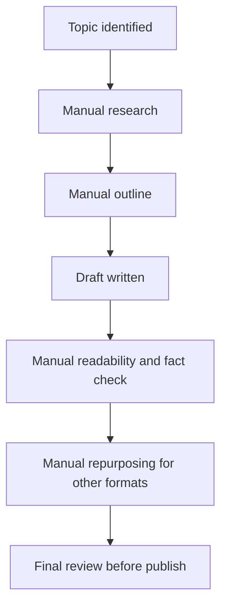
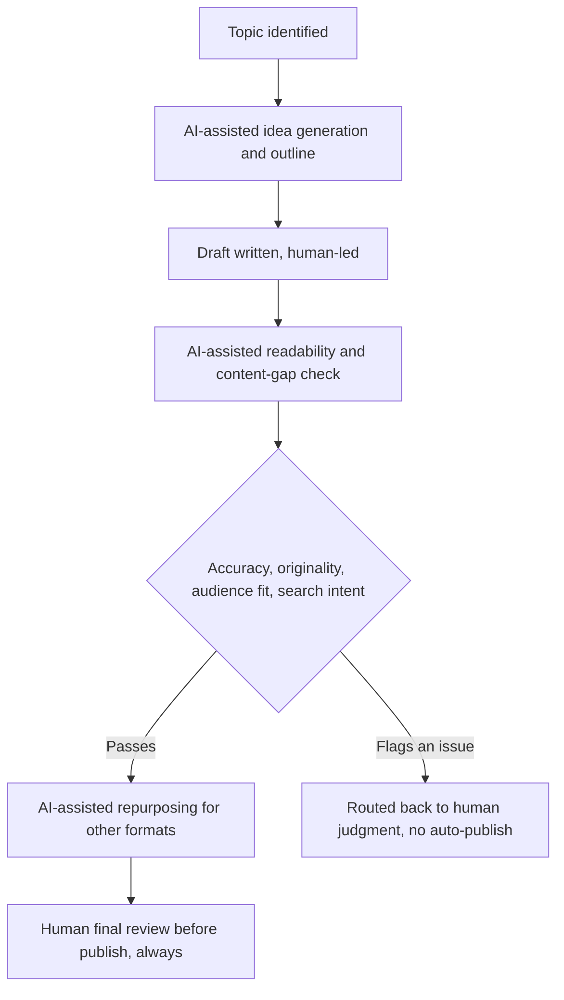

# Where the Editing Workflow Draws the Line

## The Trigger

Content production has a bottleneck that has nothing to do with writing speed: review. Idea generation, outlining, gap-checks, readability passes, repurposing, all of it can move faster with AI in the loop. But speeding up the input side doesn't mean anything if the output side still needs the same level of human scrutiny it always did.

I built an AI-assisted workflow to test where that line actually sits.

## Current State: Manual Content Production

## Failure Points

1. **Research and outlining consume disproportionate time** relative to the judgment calls that actually matter later.
2. **Repurposing gets skipped under deadline pressure**, even though it's mostly mechanical work.
3. **Review quality is inconsistent** when the same person did the drafting and is rushed on the review pass.

## Proposed Flow: Where AI Helps, Where It Doesn't

## The Decision Rule

AI can accelerate every stage that's mechanical: research aggregation, outline structuring, readability scoring, format repurposing. It does not get the final call on accuracy, originality, brand voice, or whether the piece actually serves the reader's intent. That review stays human, every time, regardless of how clean the AI-assisted draft looks.

## Why This Matters

Same rule as the identity work, just applied to a lower-stakes domain: speed on the front end doesn't buy you the right to skip judgment on the back end. AI's value here isn't in the words it helps generate. It's in freeing up the time a person needs to actually think about whether the piece is right.

[See the full PRD](./PRD.md)
