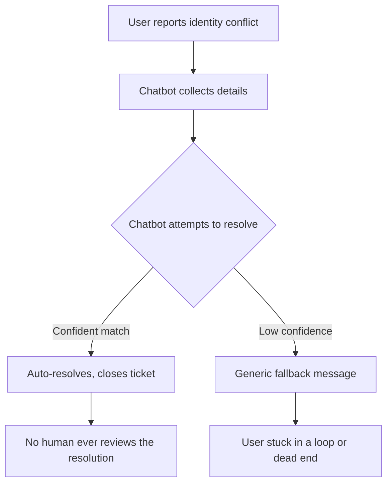
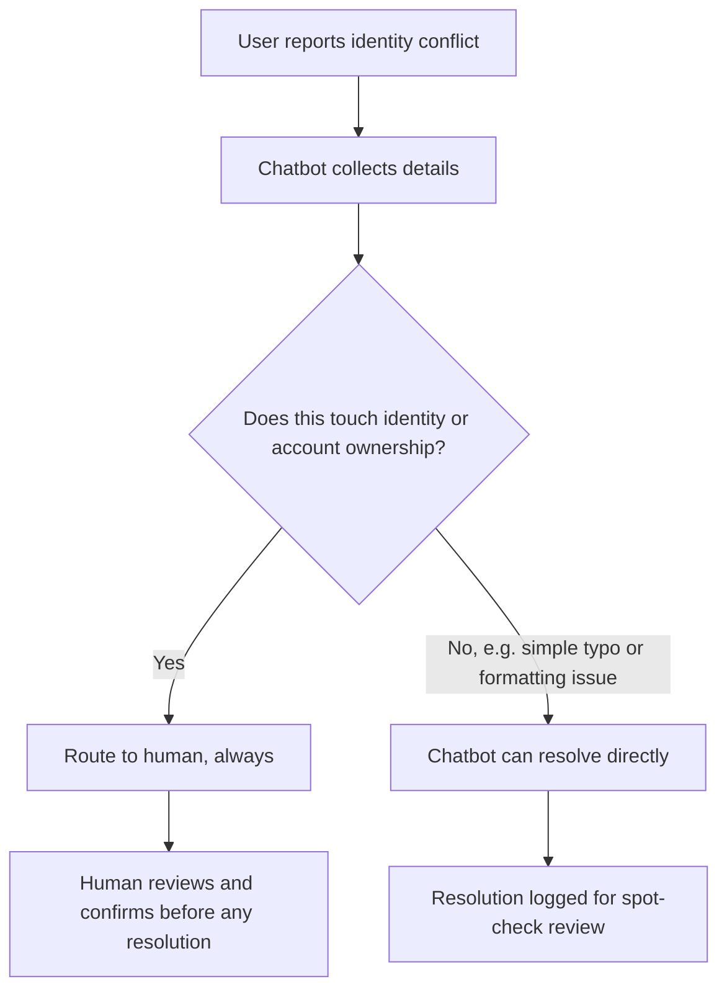

# Where the Chatbot Has to Stop

## The Trigger

I built an AI intake flow for an identity conflict workflow, the kind of scenario where a user's identity claim doesn't match what's on file, and the system has to decide what to do next.

The hardest design decision wasn't teaching the AI what to do. It was teaching it when to step back. That one rule took longer to get right than the rest of the chatbot combined.

## Current State: What Most Intake Flows Do

## Failure Points

1. **Confidence is treated as certainty.** A high-confidence match still isn't verified ownership, it's a pattern match.
2. **No distinction between conflict types.** A misspelled name and a fraudulent identity claim get routed the same way.
3. **Auto-resolution closes the loop too early.** Once the bot "resolves" it, there's no second look, by anyone.
4. **Fallback messages don't fail safely.** A generic "please try again" isn't a safe failure mode when the underlying issue is identity risk.

## Proposed Flow: Where AI Helps, Where It Doesn't

## The Decision Rule

If the case touches identity or account ownership, it goes to a person, every time, regardless of how confident the model is. Confidence is a measure of pattern match, not a measure of truth. The chatbot's job in that scenario isn't to resolve the conflict, it's to collect the information cleanly and get it to a human fast, without making the user repeat themselves.

## Why This Matters

Most AI intake design focuses on maximizing what the bot can resolve. I think that's the wrong metric here. The better question is: how cleanly can the bot recognize the moment it should stop, and how little friction does that handoff create for the person on the other end. Type "bank" into this flow and it stops. No self-resolve button. No shortcut. Every time.
