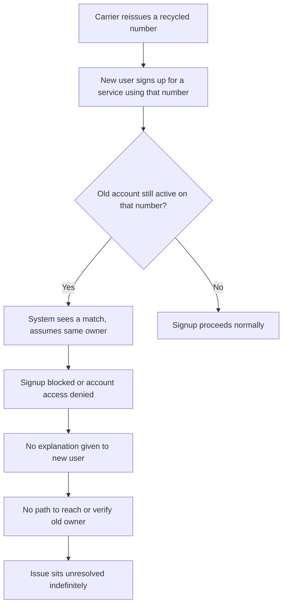
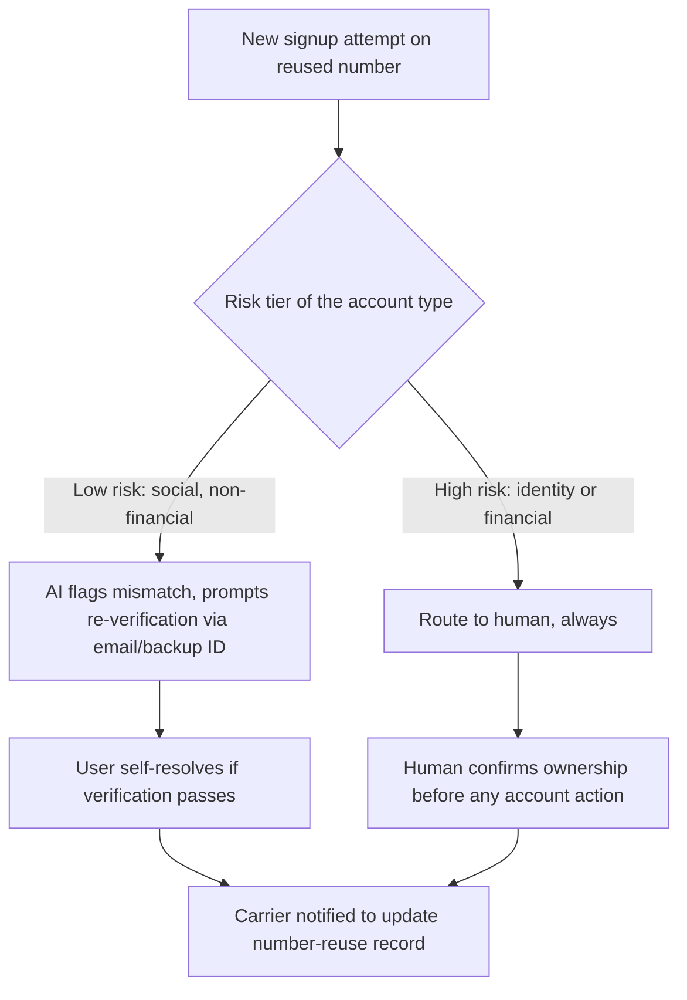

# Recycled Number, No Owner of Record

## The Trigger

I moved to Saudi Arabia and picked up a new number. A few weeks later, setting up a TikTok account for a work project, I found one already existed on that number. Clearly active. No way to reach whoever it belonged to.

Small friction on the surface. But it pointed at a bigger question: what actually happens when a carrier reissues a number, and who owns the problem when the old account never gets flagged?

I mapped it as a product problem, not a support ticket, using STC as a public example carrier since I have no insider access to their systems.

## Current State: What Happens Today

## Failure Points

1. **No expiry logic tied to number reassignment.** Carriers track number reuse; most downstream apps don't.
2. **No differentiated response.** The new user gets the same generic error whether the block is fraud-related or just a stale number.
3. **No owner-verification path.** There's no mechanism to confirm the old account is actually still the same person.
4. **No risk tiering.** A locked social media signup and a locked bank account get treated the same way today, when the actual risk is nowhere close to equal.
5. **No escalation trigger.** The issue never routes anywhere; it just sits.

## Proposed Flow: Where AI Helps, Where It Doesn't

## The Decision Rule

Anything touching identity or financial risk goes to a human. No exceptions, regardless of how confident the AI's match is. The cost of a false positive here (locking out the real owner) is asymmetric with the cost of a false negative (a slightly slower resolution for a low-risk case). AI can reduce friction on the low-risk side. It should never be the final word on the high-risk side.

## Why This Matters

This isn't really about phone numbers. It's about a pattern that shows up everywhere identity gets carried across systems that don't talk to each other: a decision made once, applied automatically forever, with no mechanism to notice when the underlying facts have changed. The fix isn't more automation. It's knowing exactly where automation should stop.

[See the full PRD](./PRD.md)
